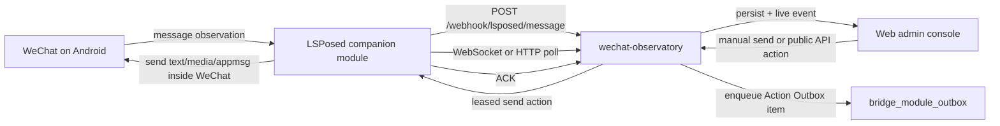

# Architecture

## Goal

`wechat-observatory` is a standalone WeChat gateway console for observing and
sending WeChat messages through a phone-installed LSPosed module.

It does not call external chat-session services, QR-login adapters, or old
protocol bridges. It also does not parse commands or generate automatic
business replies. Incoming messages are persisted and published to the admin
console and public adapter API; outbound messages are created only by explicit
admin or API actions.

## Data Flow

The gateway is the observation and manual-send point:

1. WeChat receives or sends a message on the Android device.
2. The LSPosed module observes the message and posts a normalized event to the
   gateway.
3. The gateway stores the event and publishes it to the admin console.
4. An operator or trusted adapter may queue an Action Outbox v1 item.
5. The module receives one leased batch through WebSocket or HTTP polling. The
   gateway prefers to spread each batch across different `wxid + kind` lanes,
   then the module dispatches each lane inside WeChat and ACKs the batch back
   to the gateway.

## Boundaries

`internal/bridge` owns:

- HTTP routes and API Key checks for module endpoints.
- Module registration and current `wxid` binding.
- Module message event normalization.
- Recent event history and live SSE events.
- Manual text queuing for the phone module.
- Module outbox poll/WebSocket/ACK handling.
- Persistence boundaries for registration, message events, module runtime,
  contacts, and outbox actions.

`internal/storage/mysql` owns:

- Gateway schema migrations.
- API Key, device, current WeChat binding, message, runtime, contact, and outbox
  persistence.
- Admin read projections for messages, module status, contacts, and audit
  events.

The Android module owns WeChat process I/O only:

- Read module config.
- Register current WeChat login.
- Observe received/sent WeChat events.
- Sync current contacts.
- Pull or receive leased outbound action batches.
- Prefer lane-balanced outbox batches from the gateway.
- Dispatch outbound actions inside WeChat, keeping the same `wxid + kind` lane serialized.
- ACK outbound results back to the gateway.

The module must not parse command text or mutate external business state.

## Runtime Boundary

The current runtime contains only the WeChat gateway path:

- No command parser.
- No automatic reply processor.
- No external business command service.
- No `/api/commands` or `/api/replies` admin endpoints.
- Migrations create only gateway observation, contact, runtime, API Key, device,
  current WeChat binding, and outbox tables.

Existing deployments that still contain removed legacy tables should back them
up before deletion. Current code does not create, read, or write those tables.

## Conversations

No open-session step is required.

Messages enter the gateway as generic conversation events. The bridge
normalizes WeChat endpoints into:

| Field | Meaning |
| --- | --- |
| `chat_id` | Stable conversation id. Direct chats use the peer wxid; group chats use the chatroom wxid. |
| `chat_kind` | Conversation kind, currently `direct` or `room`. |
| `room_id` | Chatroom id for group messages. |
| `sender` | Real group member wxid when the conversation is a room. |

The admin console should treat raw `wxid` values as routing identifiers and
prefer contact nickname/remark display values when available.

## WxID Isolation

The current device `wxid` is the account isolation anchor.

- Registering a module updates the current `wxid` for that device.
- `GET /api/messages` defaults to the device's current `owner_wxid` when a
  device is supplied and `owner_wxid` is omitted.
- Message views filter by `owner_wxid`, then by selected `chat_id`.
- Old events without `owner_wxid` are audit data and should not appear in the
  current-account chat list.
- Manual admin sends must include the selected module's current `owner_wxid`;
  stale owner values are rejected.

## Persistence

When `BRIDGE_MYSQL_DSN` is configured, MySQL is the durable backend. Startup can
apply migrations and seed config only when `BRIDGE_MYSQL_AUTO_MIGRATE=true`.
Long-running deployments should keep auto-migrate disabled and run
`cmd/bridge-db` explicitly.

Current gateway tables:

- `bridge_api_keys`
- `bridge_devices`
- `bridge_message_events`
- `bridge_module_outbox`
- `bridge_module_runtime`
- `bridge_module_contacts`

`module_ack` rows are stored as outbound audit events. Chat views exclude
`raw_provider=module_ack` so a WeChat message and its ACK do not render as two
chat bubbles.
